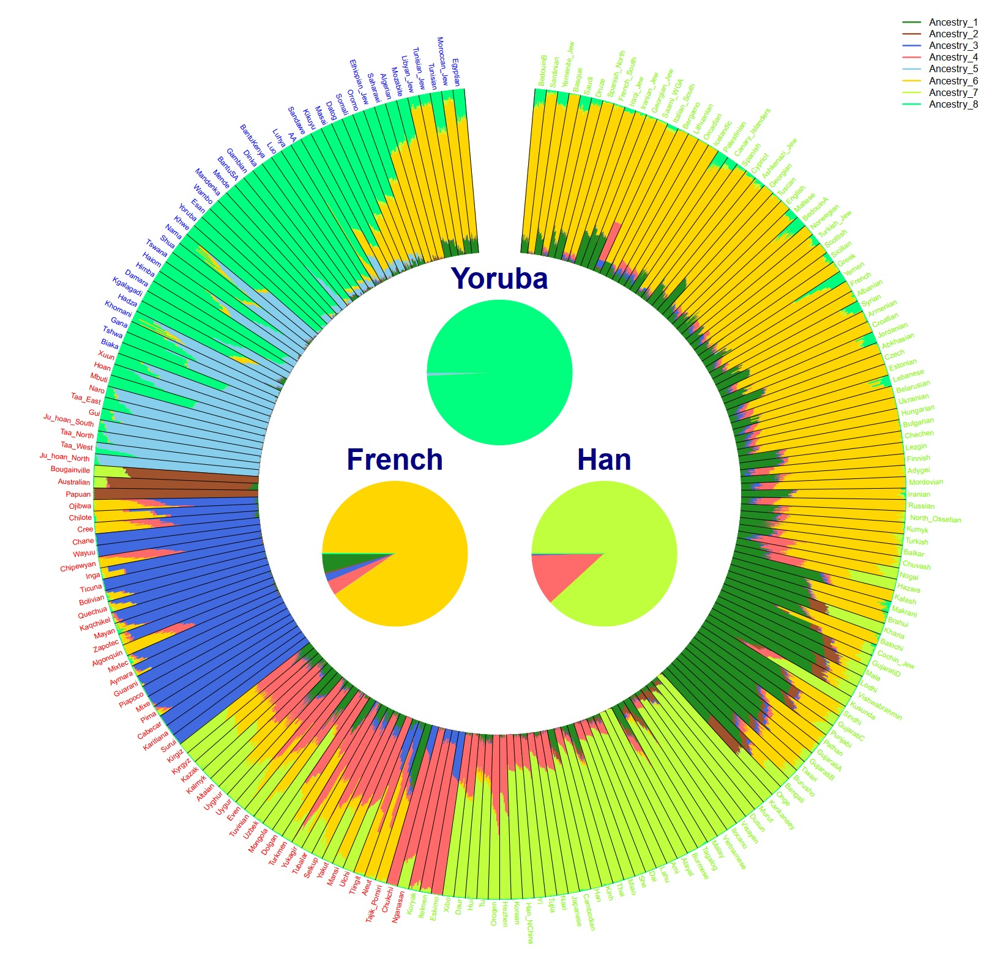
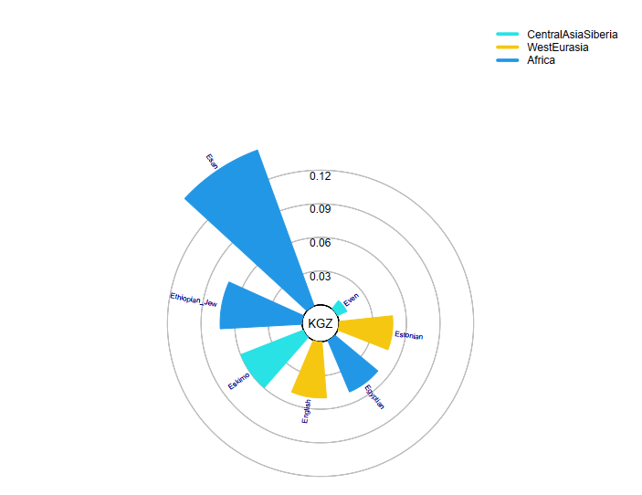

# AncestryPainter

AncestryPainter is a graphing tool developed by Qidi Feng and Dongsheng Lu in 2018 (https://doi.org/10.1016/j.gpb.2018.05.002).

Since Aug, 2021, a new version of AncestryPainter has been developed by Shuanghui Chen with her collabraters. Now this porject is still ongoing.

## Installation
```
devtools::install_github("Shuhua-Group/AncestryPainterV2")
```

## Example

Here are shown the source Code and example files of AncestryPainterV2.

### Ancestry Composition
```
# input
exp_q <- read.table("./inst/extdata/exp_ances.8.Q", header = F)
exp_ind <- read.table('./inst/extdata/exp_ances.8.ind', header = F)
exp_order <- read.table('./inst/extdata/exp_ances.8.order', stringsAsFactors = F, header = F)
exp_cols <- read.table('./inst/extdata/exp_ances.8.color', stringsAsFactors = F, header = F)$V1

# Graphing
pdf("exp_ances.8.pdf", width = 45, height = 45)
  sectorplot(Q = exp_q, ind = exp_ind, target = c("Yoruba", "French", "Han"), poporder = exp_order$V1, popgroup = exp_order$V2, ancescols = exp_cols, tar_ang1 = 90, tar_ang2 = 450, legend_mode = T)
dev.off()
```
<!-- -->


### Genetic Difference
```
# input
exp_fst.locl <- read.table("./inst/extdata/exp_fst.local.txt", header = F)

# Graphing
pdf("exp_fst.local.8.pdf", width = 10, height = 10)
  radiationplot(data = exp_fst.local, target = "KGZ", 
                legend_mode = T, sorting = T, layers = c(0.03, 0.06, 0.09, 0.12))
dev.off()
```
<!-- -->

